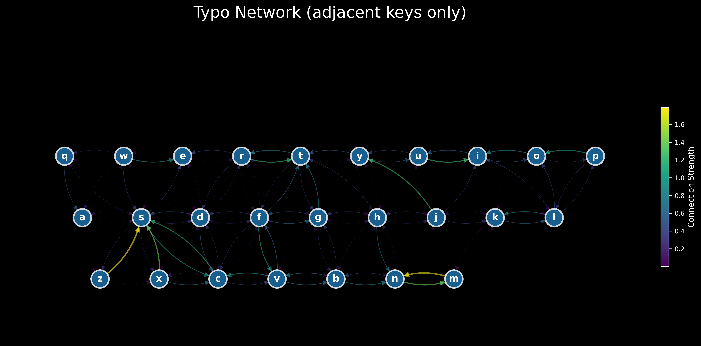

# Typosmith

A project for analyzing and generating typos using the GitHub Typo Corpus dataset.

## Overview

Typosmith is a project that leverages the [GitHub Typo Corpus](https://github.com/mhagiwara/github-typo-corpus) dataset to:
- Analyze patterns in common typographical errors
- Build models for typo generations

The visualization above shows the network of typos based on adjacent keyboard keys. The brightness and thickness of edges indicate how frequently certain key substitutions occur in the dataset.

## Dataset Source

This project uses the GitHub Typo Corpus, a large-scale multilingual dataset of misspellings and grammatical errors collected from GitHub commits. The dataset contains:
- Over 350,000 edits
- 65 million characters
- Support for more than 15 languages
- Both misspellings and grammatical errors

The dataset is available at: https://github.com/mhagiwara/github-typo-corpus

## Project Goals

1. **Analysis**: Study patterns in typographical errors across different languages and contexts
2. **Modeling**: Develop models that can generate realistic typos
3. **Applications**: Creation of realistic typos for synthetic training data

## License

This project is licensed under the same terms as the GitHub Typo Corpus dataset.
